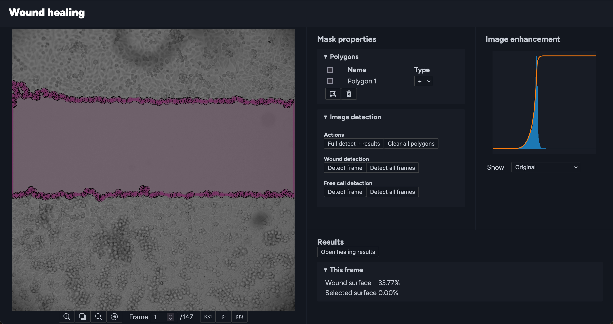

# BSMarker – User manual

## Login
First of all, the user has to be logged in. User accounts at this moment are created exclusively by the administrator.

## Landing page
The landing page of the app contains a list of **projects** with the possibility to add a new project.
Every project contains a set of **experiments**. Experiments can also be added directly on the landing page.

When the user clicks on the name of an experiment, the **experiment editor** is opened. 
If the user hovers on the settings icon for the given experiment, a menu is opened, where the user can delete the experiment.

## Experiment editor

The left part of the experiment editor contains the **Frame viewer**. The right side is divided into multiple parts – **Mask properties**, **Image enhancement** and **Results**.

### Frame viewer
The frame viewer supports zooming and panning, the current frame can be changed by using the buttons below or using arrow keys. Polygon points can be dragged, added by left click and deleted by right click.

### Mask properties
The Mask properties menu contains a list of the polygons for the given mask. Polygons can either be additive or substractive. The user may select multiple polygons to delete them or view their area.

Below the list of polygons are the image detection menus that allow launching image detection procedures for a single frame or for all frames.

### Image enhancement
In this section of the editor, a histogram of the current frame is shown with a possibility to equalize the histogram or adjust brightness of the frame.

### Results
The results section contains a button to open the current results report of the given experiment. It also shows the surface area of the mask of the current frame and the surface area of user selected polygons.

